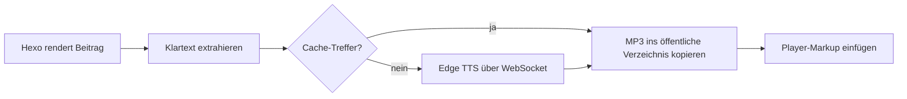

# hexo-tts-reader

> Ein Hexo-Plugin, das Ihre Beiträge vorliest. Es erstellt beim
> **Generieren** für jeden Beitrag eine MP3-Datei mit Microsoft Edge Online-TTS, speichert das Ergebnis im Cache und
> fügt einen schwebenden Audioplayer in die gerenderte Seite ein.

[](https://www.npmjs.com/package/hexo-tts-reader)
[](https://nodejs.org/)
[](./LICENSE)

<!-- README-I18N:START -->

[English](./README.md) | [汉语](./README.zh.md) | [Español](./README.es.md) | [Français](./README.fr.md) | **Deutsch** | [日本語](./README.ja.md) | [한국어](./README.ko.md) | [Português](./README.pt.md)

<!-- README-I18N:END -->

Der Browser lädt nur eine statische `<audio>`-Datei — kein TTS-Server zur Laufzeit,
kein API-Schlüssel, keine clientseitige JavaScript-Synthese. Ideal für Blogs, die
Vorlesefunktion wünschen, ohne ein Backend zu betreiben oder zur Laufzeit für eine Sprach-API zu zahlen.

## Inhaltsverzeichnis

- [Vorschau](#vorschau)
- [Funktionen](#funktionen)
- [Voraussetzungen](#voraussetzungen)
- [Installation](#installation)
- [Schnellstart](#schnellstart)
- [Konfiguration](#konfiguration)
- [Funktionsweise](#funktionsweise)
- [Stimmen](#stimmen)
- [Cache](#cache)
- [Theming](#theming)
- [Fehlerbehebung](#fehlerbehebung)
- [Hinweise und Einschränkungen](#hinweise-und-einschränkungen)
- [Entwicklung](#entwicklung)
- [Verwandte Links](#verwandte-links)
- [Lizenz](#lizenz)

---

## Vorschau

Öffnen Sie [`preview.html`](./preview.html) in Ihrem Browser, um die schwebende Player-Oberfläche
im Hell- und Dunkelmodus auszuprobieren — ohne Hexo-Site oder TTS-Netzwerkaufruf.

---

## Funktionen

- **Synthese beim Build** — kein TTS-Dienst zur Laufzeit, kein API-Schlüssel erforderlich
- **Inhalts-Hash-Cache** — unveränderte Beiträge werden zwischen Builds nicht neu synthetisiert
- **Automatische Einfügung** in Beitragsseiten oder manuelles ``-Tag für präzise Platzierung
- **Schwebender Player** mit Wiedergabe / Pause / Suche / Wiedergabegeschwindigkeit (0.75× – 2×)
- **Hell- und Dunkelthemen**, per Tastatur bedienbar
- **Intelligente Textextraktion** — überspringt Codeblöcke, Skripte, Styles und eingebettete Medien
- **Sicher für lange Beiträge** — teilt Eingaben an Satzgrenzen und verkettet MP3-Frames
- **Pro Beitrag deaktivierbar** über Front-Matter

---

## Voraussetzungen

- Node.js **>= 18**
- Hexo **>= 5**
- Netzwerkzugriff auf Microsoft Edge Online-TTS zum Build-Zeitpunkt

---

## Installation

```bash
npm install hexo-tts-reader --save
```

oder mit `yarn` / `pnpm`:

```bash
yarn add hexo-tts-reader
pnpm add hexo-tts-reader
```

---

## Schnellstart

1. Installieren Sie das Plugin.
2. Fügen Sie Folgendes zur `_config.yml` Ihrer Site hinzu:

   ```yaml
   reader:
     enable: true
   ```

3. Führen Sie `hexo clean && hexo generate` (oder `hexo server`) aus. Jede Beitragsseite erhält
   einen schwebenden Player-Button (Standardbeschriftung: `朗读本文`) in der unteren rechten
   Ecke. Ändern Sie `buttonLabel` in der Konfiguration für Ihre Sprache.

Das war's. Bei nachfolgenden Builds bedeutet der Inhalts-Hash-Cache, dass nur geänderte
Beiträge den TTS-Dienst aufrufen.

---

## Konfiguration

Vollständige Konfiguration mit Standardwerten:

```yaml
reader:
  enable: true
  autoInject: true
  voice: zh-CN-XiaoxiaoNeural
  rate: 0                                    # -100..100, relative percent
  pitch: 0                                   # -100..100, relative percent
  outputFormat: audio-24khz-48kbitrate-mono-mp3
  audioDir: audio                            # public audio output dir
  cacheDir: .hexo-reader-cache               # local cache dir (gitignore it)
  position: bottom-right                     # bottom-right | bottom-left | top-right | top-left
  buttonLabel: 朗读本文
  chunkSize: 4000                            # split long posts into <= N chars per request
  maxTextLength: 100000                      # hard upper bound per post
  failOnError: false                         # if true, build fails when TTS fails
  timeoutMs: 60000                           # per-chunk TTS timeout (ms)
  skip: []                                   # list of substrings to match against post.source
```

### Optionsreferenz

| Option | Typ | Standard | Hinweise |
| --- | --- | --- | --- |
| `enable` | boolean | `true` | Hauptschalter. |
| `autoInject` | boolean | `true` | Fügt den Player automatisch jedem Beitrag hinzu. Deaktivieren, wenn Sie nur `` verwenden möchten. |
| `voice` | string | `zh-CN-XiaoxiaoNeural` | Beliebige Microsoft Edge Online-TTS-Stimmen-ID. |
| `rate` | number | `0` | Relative Sprechgeschwindigkeit, `-100..100`. Werte außerhalb des Bereichs werden begrenzt. |
| `pitch` | number | `0` | Relative Tonhöhe, `-100..100`. Werte außerhalb des Bereichs werden begrenzt. |
| `outputFormat` | string | `audio-24khz-48kbitrate-mono-mp3` | Jedes von `msedge-tts` unterstützte Format. |
| `audioDir` | string | `audio` | Öffentlicher Pfad unter dem Site-Root, in dem MP3s ausgegeben werden. Path Traversal wird abgelehnt. |
| `cacheDir` | string | `.hexo-reader-cache` | Lokales Cache-Verzeichnis (aufgelöst vom Basisverzeichnis der Site). Überlebt Builds hinweg. |
| `position` | enum | `bottom-right` | Einer von `bottom-right`, `bottom-left`, `top-right`, `top-left`. |
| `buttonLabel` | string | `朗读本文` | aria-label / Tooltip des Umschaltbuttons. |
| `chunkSize` | number | `4000` | Maximale Zeichen pro TTS-Anfrage, `200..8000`. |
| `maxTextLength` | number | `100000` | Harte Obergrenze pro Beitrag, `100..1000000`. Längerer Text wird abgeschnitten. |
| `failOnError` | boolean | `false` | Wenn `true`, bricht ein TTS-Fehler den gesamten `hexo generate` ab. |
| `timeoutMs` | number | `60000` | WebSocket-Timeout pro Chunk, `5000..600000`. |
| `skip` | string[] | `[]` | Teilstrings, die gegen `post.source` geprüft werden, um ausgewählte Beiträge zu überspringen. |

### Pro Beitrag deaktivieren

Im Front-Matter eines Beitrags:

```yaml
---
title: My private post
reader: false
---
```

### Manuelle Platzierung

Fügen Sie den Player an beliebiger Stelle in einem Beitrag mit dem ``-Tag ein. Wenn das
Tag vorhanden ist, wird die automatische Einfügung für diesen Beitrag unterdrückt, sodass Sie nur
einen Player erhalten:

```markdown
Some intro text.



The rest of the article.
```

### Nach Pfad überspringen

```yaml
reader:
  skip:
    - "draft/"
    - "_posts/private/"
```

Jeder Beitrag, dessen `source` eine der obigen Teilstrings enthält, wird übersprungen.

---

## Funktionsweise



1. Nachdem Hexo einen Beitrag rendert (`after_post_render`-Filter), extrahiert das Plugin
   eine TTS-freundliche Klartextdarstellung aus dem HTML. Codeblöcke,
   Skripte, Styles und eingebettete Medien werden entfernt.
2. Ein SHA-1 von `{ text, voice, rate, pitch, format }` wird zum Cache-Schlüssel.
3. Wenn `<cacheDir>/<key>.mp3` bereits existiert, wird es wiederverwendet. Andernfalls öffnet das
   Plugin eine WebSocket-Verbindung zu Microsoft Edge TTS (über [`msedge-tts`][msedge]) und schreibt
   das Ergebnis atomar (`*.tmp` → rename).
4. Lange Eingaben werden an Satzgrenzen (chinesische und englische Interpunktion) aufgeteilt,
   Chunk für Chunk synthetisiert und als rohe MP3-Frames verkettet — was für die Wiedergabe sicher ist.
5. Der Generator gibt die MP3 unter `<audioDir>/<key>.mp3` aus, plus eine gemeinsame
   `reader.js` / `reader.css` unter `assets/hexo-reader/`.
6. Das Player-Markup und ein `<link>` / `<script>`-Snippet werden dem Beitragsinhalt angehängt,
   damit es mit der statischen Site ausgeliefert wird.

[msedge]: https://www.npmjs.com/package/msedge-tts

---

## Stimmen

Jede von Microsoft Edge Online-TTS unterstützte Stimme funktioniert. Einige Beispiele:

| Voice id | Locale | Hinweise |
| --- | --- | --- |
| `zh-CN-XiaoxiaoNeural` | zh-CN | Standard, weiblich |
| `zh-CN-YunxiNeural` | zh-CN | Männlich |
| `zh-CN-YunyangNeural` | zh-CN | Männlich, Nachrichtenstil |
| `en-US-AriaNeural` | en-US | Weiblich |
| `en-US-GuyNeural` | en-US | Männlich |
| `ja-JP-NanamiNeural` | ja-JP | Weiblich |
| `ko-KR-SunHiNeural` | ko-KR | Weiblich |

Eine vollständige Liste finden Sie im Upstream-Stimmenkatalog oder führen Sie eine `voices`-Abfrage über
`msedge-tts` aus.

---

## Cache

- Der Cache befindet sich unter `<site>/<cacheDir>` und überlebt Builds hinweg.
- Er basiert auf dem **Inhalt**, nicht auf dem Dateinamen, sodass Umbenennungen keine
  Neusynthese auslösen und kleine Änderungen nur die betroffenen Beiträge neu generieren.
- Um eine vollständige Neusynthese zu erzwingen, löschen Sie das Cache-Verzeichnis.
- Empfohlener `.gitignore`-Eintrag:

  ```gitignore
  .hexo-reader-cache/
  ```

---

## Theming

Der eingefügte Player verwendet CSS-Klassen mit dem Präfix `hexo-reader__`. Um Farben
anzupassen, überschreiben Sie sie im Stylesheet Ihres Themes, zum Beispiel:

```css
.hexo-reader__toggle {
  background: #1f6feb;
  color: #fff;
}
.hexo-reader__panel {
  border-radius: 12px;
}
```

Der Player respektiert `prefers-color-scheme: dark` standardmäßig.

---

## Fehlerbehebung

**Der Build hängt oder läuft bei `hexo generate` in ein Timeout.**
Ihr Build benötigt Netzwerkzugriff auf Edge TTS. Wenn Sie hinter einer Firewall sind oder
offline arbeiten, setzen Sie `failOnError: false` (Standard), damit Fehler elegant abgemildert werden,
oder überspringen Sie betroffene Beiträge über `skip`.

**Ein Beitrag hat nach dem Build keinen Player.**
Prüfen Sie das Hexo-Log auf `hexo-reader: TTS failed for "<title>"`. Wenn TTS fehlgeschlagen ist
und `failOnError` `false` ist, wird der Player für diesen Beitrag stillschweigend übersprungen.

**Der Player erscheint zweimal in einem Beitrag.**
Kombinieren Sie nicht `autoInject: true` mit dem ``-Tag im selben Beitrag.
Das Plugin unterdrückt die automatische Einfügung bereits, wenn das Tag vorhanden ist — stellen Sie sicher,
dass das Tag gerendert wird (nicht auskommentiert) und dass kein Theme-Template eine eigene Kopie hinzufügt.

**Audio wird nicht abgespielt / 404.**
Stellen Sie sicher, dass Ihr Deployment die Verzeichnisse `audio/` und `assets/hexo-reader/` enthält.
Wenn Sie ein nicht standardmäßiges `audioDir` setzen, stellen Sie sicher, dass es nicht durch Ihre CDN-Regeln blockiert wird.

**Ich möchte die Site veröffentlichen, ohne jemals TTS aufzurufen.**
Füllen Sie `<cacheDir>` mit zuvor generierten MP3-Dateien vor. Das Plugin
verwendet sie per Inhalts-Hash wieder, ohne das Netzwerk zu kontaktieren.

---

## Hinweise und Einschränkungen

- Die Synthese erfolgt zum Build-Zeitpunkt und erfordert Netzwerkzugriff auf Edge TTS.
- Erfordert `msedge-tts` >= 2.0.5 (mit diesem Plugin gebündelt). Microsoft hat die Edge Read
  Aloud-API Ende 2025 geändert; ältere Clients erhalten eine HTML-Fehlerseite statt Audio.
- Jeder Beitrag wird zu einer MP3; sehr lange Beiträge werden aufgeteilt und verkettet.
- Wenn TTS für einen Beitrag fehlschlägt und `failOnError` `false` ist (Standard), wird der Player
  für diesen Beitrag einfach nicht eingefügt und der Build setzt fort.
- Der Cache-Schlüssel ist ein SHA-1 aus Klartext + Syntheseparametern. Er dient nur als
  Inhaltskennung, nicht zur Sicherheit.

---

## Entwicklung

```bash
git clone https://github.com/xichenx/hexo-tts-reader.git
cd hexo-tts-reader
npm install
npm test
```

Tests verwenden den integrierten Node-Test-Runner (`node --test`).

---

## Verwandte Links

- [npm-Paket](https://www.npmjs.com/package/hexo-tts-reader)
- [GitHub-Repository](https://github.com/xichenx/hexo-tts-reader)
- [Problem melden](https://github.com/xichenx/hexo-tts-reader/issues)
- [msedge-tts](https://www.npmjs.com/package/msedge-tts) — zugrunde liegender TTS-Client

---

## Lizenz

[MIT](./LICENSE) © 刘明智(xichen)
