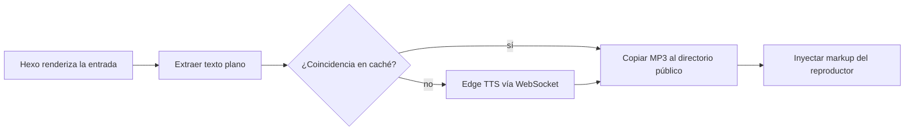

# hexo-tts-reader

> Un plugin de Hexo que lee tus entradas en voz alta. Genera un MP3 para cada entrada en
> **tiempo de generación** usando Microsoft Edge TTS en línea, almacena el resultado en caché e
> inyecta un reproductor de audio flotante en la página renderizada.

[](https://www.npmjs.com/package/hexo-tts-reader)
[](https://nodejs.org/)
[](./LICENSE)

<!-- README-I18N:START -->

[English](./README.md) | [汉语](./README.zh.md) | **Español** | [Français](./README.fr.md) | [Deutsch](./README.de.md) | [日本語](./README.ja.md) | [한국어](./README.ko.md) | [Português](./README.pt.md)

<!-- README-I18N:END -->

El navegador solo carga un archivo `<audio>` estático: sin servidor TTS en tiempo de ejecución,
sin clave API, sin síntesis JavaScript en el cliente. Ideal para blogs que quieren
lectura en voz alta sin operar un backend ni pagar por una API de voz en tiempo de ejecución.

## Tabla de contenidos

- [Vista previa](#vista-previa)
- [Características](#características)
- [Requisitos](#requisitos)
- [Instalación](#instalación)
- [Inicio rápido](#inicio-rápido)
- [Configuración](#configuración)
- [Cómo funciona](#cómo-funciona)
- [Voces](#voces)
- [Caché](#caché)
- [Tematización](#tematización)
- [Solución de problemas](#solución-de-problemas)
- [Notas y limitaciones](#notas-y-limitaciones)
- [Desarrollo](#desarrollo)
- [Enlaces relacionados](#enlaces-relacionados)
- [Licencia](#licencia)

---

## Vista previa

Abre [`preview.html`](./preview.html) en tu navegador para probar la interfaz del reproductor
flotante en modo claro y oscuro — sin necesidad de un sitio Hexo ni de una llamada de red TTS.

---

## Características

- **Síntesis en tiempo de compilación** — sin servicio TTS en tiempo de ejecución, sin clave API
- **Caché por hash de contenido** — las entradas sin cambios no se vuelven a sintetizar entre compilaciones
- **Inyección automática** en páginas de entradas, o etiqueta manual `` para una ubicación precisa
- **Reproductor flotante** con reproducción / pausa / búsqueda / velocidad de reproducción (0.75× – 2×)
- **Temas claro y oscuro**, accesible por teclado
- **Extracción inteligente de texto** — omite bloques de código, scripts, estilos y medios incrustados
- **Seguro para entradas largas** — divide la entrada en límites de oración y concatena fotogramas MP3
- **Exclusión por entrada** mediante front-matter

---

## Requisitos

- Node.js **>= 18**
- Hexo **>= 5**
- Acceso de red a Microsoft Edge TTS en línea en tiempo de compilación

---

## Instalación

```bash
npm install hexo-tts-reader --save
```

o con `yarn` / `pnpm`:

```bash
yarn add hexo-tts-reader
pnpm add hexo-tts-reader
```

---

## Inicio rápido

1. Instala el plugin.
2. Añade lo siguiente al `_config.yml` de tu sitio:

   ```yaml
   reader:
     enable: true
   ```

3. Ejecuta `hexo clean && hexo generate` (o `hexo server`). Cada página de entrada tendrá
   un botón de reproductor flotante (etiqueta predeterminada: `朗读本文`) en la esquina inferior
   derecha. Cambia `buttonLabel` en la configuración para tu idioma.

Eso es todo. En compilaciones posteriores, la caché por hash de contenido significa que solo las
entradas modificadas acceden al servicio TTS.

---

## Configuración

Configuración completa con valores predeterminados:

```yaml
reader:
  enable: true
  autoInject: true
  voice: zh-CN-XiaoxiaoNeural
  rate: 0                                    # -100..100, relative percent
  pitch: 0                                   # -100..100, relative percent
  outputFormat: audio-24khz-48kbitrate-mono-mp3
  audioDir: audio                            # public audio output dir
  cacheDir: .hexo-reader-cache               # local cache dir (gitignore it)
  position: bottom-right                     # bottom-right | bottom-left | top-right | top-left
  buttonLabel: 朗读本文
  chunkSize: 4000                            # split long posts into <= N chars per request
  maxTextLength: 100000                      # hard upper bound per post
  failOnError: false                         # if true, build fails when TTS fails
  timeoutMs: 60000                           # per-chunk TTS timeout (ms)
  skip: []                                   # list of substrings to match against post.source
```

### Referencia de opciones

| Opción | Tipo | Predeterminado | Notas |
| --- | --- | --- | --- |
| `enable` | boolean | `true` | Interruptor principal. |
| `autoInject` | boolean | `true` | Añade el reproductor a cada entrada automáticamente. Desactívalo si solo quieres usar ``. |
| `voice` | string | `zh-CN-XiaoxiaoNeural` | Cualquier id de voz de Microsoft Edge TTS en línea. |
| `rate` | number | `0` | Velocidad de habla relativa, `-100..100`. Los valores fuera de rango se limitan. |
| `pitch` | number | `0` | Tono relativo, `-100..100`. Los valores fuera de rango se limitan. |
| `outputFormat` | string | `audio-24khz-48kbitrate-mono-mp3` | Cualquier formato compatible con `msedge-tts`. |
| `audioDir` | string | `audio` | Ruta pública bajo la raíz del sitio donde se emiten los MP3. Se rechaza el path traversal. |
| `cacheDir` | string | `.hexo-reader-cache` | Directorio de caché local (resuelto desde el directorio base del sitio). Persiste entre compilaciones. |
| `position` | enum | `bottom-right` | Una de `bottom-right`, `bottom-left`, `top-right`, `top-left`. |
| `buttonLabel` | string | `朗读本文` | aria-label / tooltip del botón de alternancia. |
| `chunkSize` | number | `4000` | Máximo de caracteres por solicitud TTS, `200..8000`. |
| `maxTextLength` | number | `100000` | Límite máximo por entrada, `100..1000000`. El texto más largo se trunca. |
| `failOnError` | boolean | `false` | Cuando es `true`, un fallo de TTS aborta todo el `hexo generate`. |
| `timeoutMs` | number | `60000` | Tiempo de espera WebSocket por fragmento, `5000..600000`. |
| `skip` | string[] | `[]` | Subcadenas comparadas con `post.source` para omitir entradas seleccionadas. |

### Desactivar por entrada

En el front-matter de una entrada:

```yaml
---
title: My private post
reader: false
---
```

### Ubicación manual

Inserta el reproductor en cualquier parte de una entrada con la etiqueta ``. Cuando la
etiqueta está presente, la inyección automática se suprime para esa entrada, de modo que solo
obtienes un reproductor:

```markdown
Some intro text.



The rest of the article.
```

### Omitir por ruta

```yaml
reader:
  skip:
    - "draft/"
    - "_posts/private/"
```

Cualquier entrada cuyo `source` contenga una de las subcadenas anteriores se omite.

---

## Cómo funciona



1. Después de que Hexo renderiza una entrada (filtro `after_post_render`), el plugin extrae
   una representación de texto plano apta para TTS del HTML. Se eliminan bloques de código,
   scripts, estilos y medios incrustados.
2. Un SHA-1 de `{ text, voice, rate, pitch, format }` se convierte en la clave de caché.
3. Si `<cacheDir>/<key>.mp3` ya existe, se reutiliza. De lo contrario, el plugin abre un
   WebSocket a Microsoft Edge TTS (mediante [`msedge-tts`][msedge]) y escribe el resultado de
   forma atómica (`*.tmp` → rename).
4. Las entradas largas se dividen en límites de oración (puntuación china e inglesa),
   se sintetizan fragmento a fragmento y se concatenan como fotogramas MP3 sin procesar, lo cual
   es seguro para la reproducción.
5. El generador emite el MP3 bajo `<audioDir>/<key>.mp3`, además de un `reader.js` / `reader.css`
   compartido bajo `assets/hexo-reader/`.
6. El markup del reproductor y un fragmento `<link>` / `<script>` se añaden al contenido de la
   entrada para que se publique con el sitio estático.

[msedge]: https://www.npmjs.com/package/msedge-tts

---

## Voces

Funciona cualquier voz compatible con Microsoft Edge TTS en línea. Algunos ejemplos:

| Voice id | Locale | Notas |
| --- | --- | --- |
| `zh-CN-XiaoxiaoNeural` | zh-CN | Predeterminada, femenina |
| `zh-CN-YunxiNeural` | zh-CN | Masculina |
| `zh-CN-YunyangNeural` | zh-CN | Masculina, estilo noticias |
| `en-US-AriaNeural` | en-US | Femenina |
| `en-US-GuyNeural` | en-US | Masculina |
| `ja-JP-NanamiNeural` | ja-JP | Femenina |
| `ko-KR-SunHiNeural` | ko-KR | Femenina |

Para una lista completa, consulta el catálogo de voces upstream o ejecuta una consulta `voices` mediante
`msedge-tts`.

---

## Caché

- La caché reside en `<site>/<cacheDir>` y persiste entre compilaciones.
- Se basa en el **contenido**, no en el nombre del archivo, por lo que los renombrados no provocan
  una nueva síntesis y las ediciones menores solo regeneran las entradas afectadas.
- Para forzar una nueva síntesis completa, elimina el directorio de caché.
- Entrada recomendada en `.gitignore`:

  ```gitignore
  .hexo-reader-cache/
  ```

---

## Tematización

El reproductor inyectado usa clases CSS con el prefijo `hexo-reader__`. Para personalizar los
colores, sobrescríbelos en la hoja de estilos de tu tema, por ejemplo:

```css
.hexo-reader__toggle {
  background: #1f6feb;
  color: #fff;
}
.hexo-reader__panel {
  border-radius: 12px;
}
```

El reproductor respeta `prefers-color-scheme: dark` de forma predeterminada.

---

## Solución de problemas

**La compilación se cuelga o agota el tiempo de espera en `hexo generate`.**
Tu compilación necesita acceso de red a Edge TTS. Si estás detrás de un firewall o
ejecutas sin conexión, establece `failOnError: false` (predeterminado) para que los fallos
degraden con elegancia, u omite las entradas afectadas mediante `skip`.

**Una entrada no tiene reproductor después de la compilación.**
Revisa el registro de Hexo en busca de `hexo-reader: TTS failed for "<title>"`. Si TTS falló
y `failOnError` es `false`, el reproductor se omite silenciosamente para esa entrada.

**El reproductor aparece dos veces en una entrada.**
No combines `autoInject: true` con la etiqueta `` en la misma entrada.
El plugin ya suprime la inyección automática cuando la etiqueta está presente — asegúrate de que
la etiqueta se renderice (no esté comentada) y de que ninguna plantilla del tema añada
su propia copia.

**El audio no se reproduce / 404.**
Asegúrate de que tu despliegue incluya los directorios `audio/` y `assets/hexo-reader/`.
Si estableces un `audioDir` no predeterminado, verifica que no esté bloqueado por las reglas de tu CDN.

**Quiero publicar el sitio sin llamar nunca a TTS.**
Prellena `<cacheDir>` con archivos MP3 generados previamente. El plugin los reutiliza por hash
de contenido sin acceder a la red.

---

## Notas y limitaciones

- La síntesis ocurre en tiempo de compilación y requiere acceso de red a Edge TTS.
- Requiere `msedge-tts` >= 2.0.5 (incluido con este plugin). Microsoft cambió la API Edge Read
  Aloud a finales de 2025; los clientes antiguos reciben una página de error HTML en lugar de audio.
- Cada entrada se convierte en un MP3; las entradas muy largas se dividen y concatenan.
- Si TTS falla para una entrada y `failOnError` es `false` (predeterminado), el reproductor simplemente
  no se inyecta para esa entrada y la compilación continúa.
- La clave de caché es un SHA-1 del texto plano + parámetros de síntesis. Se usa solo como
  identificador de contenido, no para seguridad.

---

## Desarrollo

```bash
git clone https://github.com/xichenx/hexo-tts-reader.git
cd hexo-tts-reader
npm install
npm test
```

Las pruebas usan el ejecutor de pruebas integrado de Node (`node --test`).

---

## Enlaces relacionados

- [Paquete npm](https://www.npmjs.com/package/hexo-tts-reader)
- [Repositorio GitHub](https://github.com/xichenx/hexo-tts-reader)
- [Reportar un problema](https://github.com/xichenx/hexo-tts-reader/issues)
- [msedge-tts](https://www.npmjs.com/package/msedge-tts) — cliente TTS subyacente

---

## Licencia

[MIT](./LICENSE) © 刘明智(xichen)
