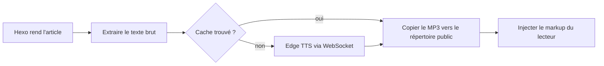

# hexo-tts-reader

> Un plugin Hexo qui lit vos articles à voix haute. Il génère un MP3 pour chaque article au
> **moment de la génération** en utilisant Microsoft Edge TTS en ligne, met le résultat en cache et
> injecte un lecteur audio flottant dans la page rendue.

[](https://www.npmjs.com/package/hexo-tts-reader)
[](https://nodejs.org/)
[](./LICENSE)

<!-- README-I18N:START -->

[English](./README.md) | [汉语](./README.zh.md) | [Español](./README.es.md) | **Français** | [Deutsch](./README.de.md) | [日本語](./README.ja.md) | [한국어](./README.ko.md) | [Português](./README.pt.md)

<!-- README-I18N:END -->

Le navigateur ne charge qu'un fichier `<audio>` statique — pas de serveur TTS à l'exécution,
pas de clé API, pas de synthèse JavaScript côté client. Idéal pour les blogs qui souhaitent
la lecture à voix haute sans exploiter de backend ni payer une API vocale à l'exécution.

## Table des matières

- [Aperçu](#aperçu)
- [Fonctionnalités](#fonctionnalités)
- [Prérequis](#prérequis)
- [Installation](#installation)
- [Démarrage rapide](#démarrage-rapide)
- [Configuration](#configuration)
- [Fonctionnement](#fonctionnement)
- [Voix](#voix)
- [Cache](#cache)
- [Personnalisation du thème](#personnalisation-du-thème)
- [Dépannage](#dépannage)
- [Notes et limitations](#notes-et-limitations)
- [Développement](#développement)
- [Liens connexes](#liens-connexes)
- [Licence](#licence)

---

## Aperçu

Ouvrez [`preview.html`](./preview.html) dans votre navigateur pour essayer l'interface du lecteur
flottant en mode clair et sombre — sans site Hexo ni appel réseau TTS requis.

---

## Fonctionnalités

- **Synthèse à la compilation** — pas de service TTS à l'exécution, pas de clé API requise
- **Cache par hash de contenu** — les articles inchangés ne sont pas re-synthétisés entre les compilations
- **Injection automatique** dans les pages d'articles, ou balise manuelle `` pour un placement précis
- **Lecteur flottant** avec lecture / pause / recherche / vitesse de lecture (0.75× – 2×)
- **Thèmes clair et sombre**, accessible au clavier
- **Extraction intelligente du texte** — ignore les blocs de code, scripts, styles et médias intégrés
- **Adapté aux longs articles** — découpe l'entrée aux limites de phrase et concatène les trames MP3
- **Désactivation par article** via le front-matter

---

## Prérequis

- Node.js **>= 18**
- Hexo **>= 5**
- Accès réseau à Microsoft Edge TTS en ligne au moment de la compilation

---

## Installation

```bash
npm install hexo-tts-reader --save
```

ou avec `yarn` / `pnpm` :

```bash
yarn add hexo-tts-reader
pnpm add hexo-tts-reader
```

---

## Démarrage rapide

1. Installez le plugin.
2. Ajoutez ce qui suit au `_config.yml` de votre site :

   ```yaml
   reader:
     enable: true
   ```

3. Exécutez `hexo clean && hexo generate` (ou `hexo server`). Chaque page d'article aura
   un bouton de lecteur flottant (libellé par défaut : `朗读本文`) dans le coin inférieur
   droit. Modifiez `buttonLabel` dans la configuration pour votre langue.

C'est tout. Lors des compilations suivantes, le cache par hash de contenu signifie que seuls les
articles modifiés sollicitent le service TTS.

---

## Configuration

Configuration complète avec les valeurs par défaut :

```yaml
reader:
  enable: true
  autoInject: true
  voice: zh-CN-XiaoxiaoNeural
  rate: 0                                    # -100..100, relative percent
  pitch: 0                                   # -100..100, relative percent
  outputFormat: audio-24khz-48kbitrate-mono-mp3
  audioDir: audio                            # public audio output dir
  cacheDir: .hexo-reader-cache               # local cache dir (gitignore it)
  position: bottom-right                     # bottom-right | bottom-left | top-right | top-left
  buttonLabel: 朗读本文
  chunkSize: 4000                            # split long posts into <= N chars per request
  maxTextLength: 100000                      # hard upper bound per post
  failOnError: false                         # if true, build fails when TTS fails
  timeoutMs: 60000                           # per-chunk TTS timeout (ms)
  skip: []                                   # list of substrings to match against post.source
```

### Référence des options

| Option | Type | Défaut | Notes |
| --- | --- | --- | --- |
| `enable` | boolean | `true` | Interrupteur principal. |
| `autoInject` | boolean | `true` | Ajoute le lecteur à chaque article automatiquement. Désactivez si vous souhaitez uniquement utiliser ``. |
| `voice` | string | `zh-CN-XiaoxiaoNeural` | Tout identifiant de voix Microsoft Edge TTS en ligne. |
| `rate` | number | `0` | Vitesse de parole relative, `-100..100`. Les valeurs hors plage sont limitées. |
| `pitch` | number | `0` | Hauteur relative, `-100..100`. Les valeurs hors plage sont limitées. |
| `outputFormat` | string | `audio-24khz-48kbitrate-mono-mp3` | Tout format pris en charge par `msedge-tts`. |
| `audioDir` | string | `audio` | Chemin public sous la racine du site où les MP3 sont émis. Le path traversal est rejeté. |
| `cacheDir` | string | `.hexo-reader-cache` | Répertoire de cache local (résolu depuis le répertoire de base du site). Persiste entre les compilations. |
| `position` | enum | `bottom-right` | L'une de `bottom-right`, `bottom-left`, `top-right`, `top-left`. |
| `buttonLabel` | string | `朗读本文` | aria-label / infobulle du bouton de bascule. |
| `chunkSize` | number | `4000` | Nombre maximal de caractères par requête TTS, `200..8000`. |
| `maxTextLength` | number | `100000` | Plafond strict par article, `100..1000000`. Le texte plus long est tronqué. |
| `failOnError` | boolean | `false` | Lorsque `true`, un échec TTS interrompt tout le `hexo generate`. |
| `timeoutMs` | number | `60000` | Délai d'expiration WebSocket par fragment, `5000..600000`. |
| `skip` | string[] | `[]` | Sous-chaînes comparées à `post.source` pour ignorer certains articles. |

### Désactiver par article

Dans le front-matter d'un article :

```yaml
---
title: My private post
reader: false
---
```

### Placement manuel

Insérez le lecteur n'importe où dans un article avec la balise ``. Lorsque la balise
est présente, l'injection automatique est supprimée pour cet article afin que vous n'obteniez
qu'un seul lecteur :

```markdown
Some intro text.



The rest of the article.
```

### Ignorer par chemin

```yaml
reader:
  skip:
    - "draft/"
    - "_posts/private/"
```

Tout article dont le `source` contient l'une des sous-chaînes ci-dessus est ignoré.

---

## Fonctionnement



1. Après le rendu d'un article par Hexo (filtre `after_post_render`), le plugin extrait
   une représentation en texte brut adaptée au TTS depuis le HTML. Les blocs de code,
   scripts, styles et médias intégrés sont supprimés.
2. Un SHA-1 de `{ text, voice, rate, pitch, format }` devient la clé de cache.
3. Si `<cacheDir>/<key>.mp3` existe déjà, il est réutilisé. Sinon, le plugin ouvre un
   WebSocket vers Microsoft Edge TTS (via [`msedge-tts`][msedge]) et écrit le résultat de
   manière atomique (`*.tmp` → rename).
4. Les entrées longues sont découpées aux limites de phrase (ponctuation chinoise et anglaise),
   synthétisées fragment par fragment et concaténées en tant que trames MP3 brutes — ce qui est
   sûr pour la lecture.
5. Le générateur émet le MP3 sous `<audioDir>/<key>.mp3`, ainsi qu'un `reader.js` / `reader.css`
   partagé sous `assets/hexo-reader/`.
6. Le markup du lecteur et un fragment `<link>` / `<script>` sont ajoutés au contenu de l'article
   pour qu'il soit publié avec le site statique.

[msedge]: https://www.npmjs.com/package/msedge-tts

---

## Voix

Toute voix prise en charge par Microsoft Edge TTS en ligne fonctionne. Quelques exemples :

| Voice id | Locale | Notes |
| --- | --- | --- |
| `zh-CN-XiaoxiaoNeural` | zh-CN | Par défaut, féminine |
| `zh-CN-YunxiNeural` | zh-CN | Masculine |
| `zh-CN-YunyangNeural` | zh-CN | Masculine, style actualités |
| `en-US-AriaNeural` | en-US | Féminine |
| `en-US-GuyNeural` | en-US | Masculine |
| `ja-JP-NanamiNeural` | ja-JP | Féminine |
| `ko-KR-SunHiNeural` | ko-KR | Féminine |

Pour une liste complète, consultez le catalogue de voix en amont ou exécutez une requête `voices` via
`msedge-tts`.

---

## Cache

- Le cache se trouve à `<site>/<cacheDir>` et persiste entre les compilations.
- Il est indexé sur le **contenu**, pas sur le nom de fichier, donc les renommages ne déclenchent
  pas de re-synthèse et les modifications mineures ne régénèrent que les articles concernés.
- Pour forcer une re-synthèse complète, supprimez le répertoire de cache.
- Entrée `.gitignore` recommandée :

  ```gitignore
  .hexo-reader-cache/
  ```

---

## Personnalisation du thème

Le lecteur injecté utilise des classes CSS préfixées par `hexo-reader__`. Pour personnaliser les
couleurs, remplacez-les dans la feuille de style de votre thème, par exemple :

```css
.hexo-reader__toggle {
  background: #1f6feb;
  color: #fff;
}
.hexo-reader__panel {
  border-radius: 12px;
}
```

Le lecteur respecte `prefers-color-scheme: dark` par défaut.

---

## Dépannage

**La compilation se bloque ou expire lors de `hexo generate`.**
Votre compilation nécessite un accès réseau à Edge TTS. Si vous êtes derrière un pare-feu ou
travaillez hors ligne, définissez `failOnError: false` (par défaut) pour que les échecs se
dégradent gracieusement, ou ignorez les articles concernés via `skip`.

**Un article n'a pas de lecteur après la compilation.**
Vérifiez le journal Hexo pour `hexo-reader: TTS failed for "<title>"`. Si le TTS a échoué
et que `failOnError` est `false`, le lecteur est silencieusement ignoré pour cet article.

**Le lecteur apparaît deux fois dans un article.**
Ne combinez pas `autoInject: true` avec la balise `` dans le même article.
Le plugin supprime déjà l'injection automatique lorsque la balise est présente — assurez-vous que
la balise est rendue (non commentée) et qu'aucun modèle de thème n'ajoute sa propre copie.

**L'audio ne se lit pas / 404.**
Assurez-vous que votre déploiement inclut les répertoires `audio/` et `assets/hexo-reader/`.
Si vous définissez un `audioDir` non par défaut, vérifiez qu'il n'est pas bloqué par les règles de votre CDN.

**Je veux publier le site sans jamais appeler le TTS.**
Préremplissez `<cacheDir>` avec des fichiers MP3 générés précédemment. Le plugin les réutilise
par hash de contenu sans accéder au réseau.

---

## Notes et limitations

- La synthèse a lieu à la compilation et nécessite un accès réseau à Edge TTS.
- Nécessite `msedge-tts` >= 2.0.5 (fourni avec ce plugin). Microsoft a modifié l'API Edge Read
  Aloud fin 2025 ; les anciens clients reçoivent une page d'erreur HTML au lieu de l'audio.
- Chaque article devient un MP3 ; les articles très longs sont découpés et concaténés.
- Si le TTS échoue pour un article et que `failOnError` est `false` (par défaut), le lecteur
  n'est tout simplement pas injecté pour cet article et la compilation continue.
- La clé de cache est un SHA-1 du texte brut + paramètres de synthèse. Elle sert uniquement
  d'identifiant de contenu, pas à des fins de sécurité.

---

## Développement

```bash
git clone https://github.com/xichenx/hexo-tts-reader.git
cd hexo-tts-reader
npm install
npm test
```

Les tests utilisent le test runner intégré de Node (`node --test`).

---

## Liens connexes

- [Paquet npm](https://www.npmjs.com/package/hexo-tts-reader)
- [Dépôt GitHub](https://github.com/xichenx/hexo-tts-reader)
- [Signaler un problème](https://github.com/xichenx/hexo-tts-reader/issues)
- [msedge-tts](https://www.npmjs.com/package/msedge-tts) — client TTS sous-jacent

---

## Licence

[MIT](./LICENSE) © 刘明智(xichen)
