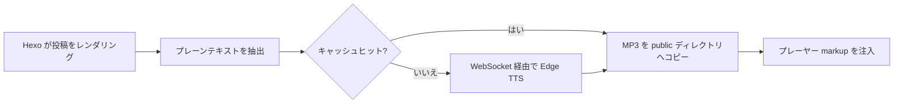

# hexo-tts-reader

> Hexo 記事を音声で読み上げるプラグインです。**生成時**に Microsoft Edge オンライン TTS
> で各投稿の MP3 を生成し、結果をキャッシュして、レンダリングされたページに
> フローティングオーディオプレーヤーを注入します。

[](https://www.npmjs.com/package/hexo-tts-reader)
[](https://nodejs.org/)
[](./LICENSE)

<!-- README-I18N:START -->

[English](./README.md) | [汉语](./README.zh.md) | [Español](./README.es.md) | [Français](./README.fr.md) | [Deutsch](./README.de.md) | **日本語** | [한국어](./README.ko.md) | [Português](./README.pt.md)

<!-- README-I18N:END -->

ブラウザが読み込むのは静的な `<audio>` ファイルのみです。ランタイム TTS サーバー、
API キー、クライアント側 JavaScript による合成は不要です。バックエンドを運用したり、
実行時に音声 API の料金を支払ったりせずに読み上げ機能を追加したいブログに最適です。

## 目次

- [プレビュー](#プレビュー)
- [機能](#機能)
- [要件](#要件)
- [インストール](#インストール)
- [クイックスタート](#クイックスタート)
- [設定](#設定)
- [仕組み](#仕組み)
- [音声](#音声)
- [キャッシュ](#キャッシュ)
- [テーマ](#テーマ)
- [トラブルシューティング](#トラブルシューティング)
- [注意事項と制限](#注意事項と制限)
- [開発](#開発)
- [関連リンク](#関連リンク)
- [ライセンス](#ライセンス)

---

## プレビュー

ブラウザで [`preview.html`](./preview.html) を開くと、Hexo サイトや TTS の
ネットワーク呼び出しなしで、ライト／ダークモードのフローティングプレーヤー UI を
試せます。

---

## 機能

- **ビルド時合成** — ランタイム TTS サービス不要、API キー不要
- **コンテンツハッシュキャッシュ** — 変更のない投稿はビルド間で再合成されない
- **自動注入** — 投稿ページへ自動追加、または `` タグで正確に配置
- **フローティングプレーヤー** — 再生 / 一時停止 / シーク / 再生速度（0.75× – 2×）
- **ライト＆ダークテーマ**、キーボード操作対応
- **スマートなテキスト抽出** — コードブロック、スクリプト、スタイル、埋め込みメディアをスキップ
- **長文対応** — 文の境界で入力を分割し、MP3 フレームを連結
- **投稿ごとのオプトアウト** — front-matter で無効化可能

---

## 要件

- Node.js **>= 18**
- Hexo **>= 5**
- ビルド時に Microsoft Edge オンライン TTS へのネットワークアクセス

---

## インストール

```bash
npm install hexo-tts-reader --save
```

または `yarn` / `pnpm` を使用：

```bash
yarn add hexo-tts-reader
pnpm add hexo-tts-reader
```

---

## クイックスタート

1. プラグインをインストールします。
2. サイトの `_config.yml` に以下を追加します：

   ```yaml
   reader:
     enable: true
   ```

3. `hexo clean && hexo generate`（または `hexo server`）を実行します。各投稿ページの
   右下にフローティングプレーヤーボタン（デフォルトラベル: `朗读本文`）が表示されます。
   ロケールに合わせて設定の `buttonLabel` を変更してください。

以上です。以降のビルドでは、コンテンツハッシュキャッシュにより変更された投稿のみが
TTS サービスを呼び出します。

---

## 設定

デフォルト値を含む完全な設定：

```yaml
reader:
  enable: true
  autoInject: true
  voice: zh-CN-XiaoxiaoNeural
  rate: 0                                    # -100..100, relative percent
  pitch: 0                                   # -100..100, relative percent
  outputFormat: audio-24khz-48kbitrate-mono-mp3
  audioDir: audio                            # public audio output dir
  cacheDir: .hexo-reader-cache               # local cache dir (gitignore it)
  position: bottom-right                     # bottom-right | bottom-left | top-right | top-left
  buttonLabel: 朗读本文
  chunkSize: 4000                            # split long posts into <= N chars per request
  maxTextLength: 100000                      # hard upper bound per post
  failOnError: false                         # if true, build fails when TTS fails
  timeoutMs: 60000                           # per-chunk TTS timeout (ms)
  skip: []                                   # list of substrings to match against post.source
```

### オプション一覧

| オプション | 型 | デフォルト | 説明 |
| --- | --- | --- | --- |
| `enable` | boolean | `true` | マスタースイッチ。 |
| `autoInject` | boolean | `true` | すべての投稿にプレーヤーを自動追加。`` のみ使う場合は無効化。 |
| `voice` | string | `zh-CN-XiaoxiaoNeural` | 任意の Microsoft Edge オンライン TTS 音声 ID。 |
| `rate` | number | `0` | 相対的な話速、`-100..100`。範囲外の値はクランプされます。 |
| `pitch` | number | `0` | 相対的なピッチ、`-100..100`。範囲外の値はクランプされます。 |
| `outputFormat` | string | `audio-24khz-48kbitrate-mono-mp3` | `msedge-tts` がサポートする任意の形式。 |
| `audioDir` | string | `audio` | サイトルート配下の MP3 公開出力パス。パストラバーサルは拒否されます。 |
| `cacheDir` | string | `.hexo-reader-cache` | ローカルキャッシュディレクトリ（サイトの base ディレクトリから解決）。ビルド間で保持。 |
| `position` | enum | `bottom-right` | `bottom-right`、`bottom-left`、`top-right`、`top-left` のいずれか。 |
| `buttonLabel` | string | `朗读本文` | トグルボタンの aria-label / ツールチップ。 |
| `chunkSize` | number | `4000` | TTS リクエストあたりの最大文字数、`200..8000`。 |
| `maxTextLength` | number | `100000` | 投稿あたりのハード上限、`100..1000000`。それより長いテキストは切り詰められます。 |
| `failOnError` | boolean | `false` | `true` の場合、TTS 失敗で `hexo generate` 全体が中止されます。 |
| `timeoutMs` | number | `60000` | チャンクごとの WebSocket タイムアウト、`5000..600000`。 |
| `skip` | string[] | `[]` | `post.source` にマッチする部分文字列のリスト。選択した投稿をスキップ。 |

### 投稿ごとに無効化

投稿の front-matter で：

```yaml
---
title: My private post
reader: false
---
```

### 手動配置

`` タグで投稿内の任意の位置にプレーヤーを挿入できます。タグが存在する場合、
その投稿では自動注入が抑制され、プレーヤーは 1 つだけ表示されます：

```markdown
Some intro text.



The rest of the article.
```

### パスでスキップ

```yaml
reader:
  skip:
    - "draft/"
    - "_posts/private/"
```

`source` に上記の部分文字列のいずれかを含む投稿はスキップされます。

---

## 仕組み



1. Hexo が投稿をレンダリングした後（`after_post_render` フィルター）、プラグインは
   HTML から TTS 向けのプレーンテキスト表現を抽出します。コードブロック、
   スクリプト、スタイル、埋め込みメディアは除去されます。
2. `{ text, voice, rate, pitch, format }` の SHA-1 がキャッシュキーになります。
3. `<cacheDir>/<key>.mp3` が既に存在する場合は再利用されます。存在しない場合、
   プラグインは [`msedge-tts`][msedge] 経由で Microsoft Edge TTS に WebSocket 接続し、
   結果をアトミックに書き込みます（`*.tmp` → rename）。
4. 長い入力は文の境界（中国語・英語の句読点）でチャンク分割され、
   チャンクごとに合成され、生の MP3 フレームとして連結されます — 再生は安全です。
5. ジェネレーターは `<audioDir>/<key>.mp3` 配下に MP3 を、`assets/hexo-reader/` 配下に
   共有の `reader.js` / `reader.css` を出力します。
6. プレーヤーの markup と `<link>` / `<script>` スニペットが投稿コンテンツに追加され、
   静的サイトと一緒に配信されます。

[msedge]: https://www.npmjs.com/package/msedge-tts

---

## 音声

Microsoft Edge オンライン TTS がサポートする任意の音声が使用できます。例：

| Voice id | Locale | 説明 |
| --- | --- | --- |
| `zh-CN-XiaoxiaoNeural` | zh-CN | デフォルト、女性 |
| `zh-CN-YunxiNeural` | zh-CN | 男性 |
| `zh-CN-YunyangNeural` | zh-CN | 男性、ニュース調 |
| `en-US-AriaNeural` | en-US | 女性 |
| `en-US-GuyNeural` | en-US | 男性 |
| `ja-JP-NanamiNeural` | ja-JP | 女性 |
| `ko-KR-SunHiNeural` | ko-KR | 女性 |

完全な一覧は、上流の音声カタログを参照するか、`msedge-tts` で `voices` クエリを
実行してください。

---

## キャッシュ

- キャッシュは `<site>/<cacheDir>` に保存され、ビルド間で保持されます。
- キーはファイル名ではなく**コンテンツ**に基づくため、リネームでは再合成されず、
  小さな編集では影響を受けた投稿のみ再生成されます。
- 完全な再合成を強制するには、キャッシュディレクトリを削除してください。
- 推奨 `.gitignore` エントリ：

  ```gitignore
  .hexo-reader-cache/
  ```

---

## テーマ

注入されるプレーヤーは `hexo-reader__` プレフィックス付きの CSS クラスを使用します。
色をカスタマイズするには、テーマのスタイルシートで上書きしてください。例：

```css
.hexo-reader__toggle {
  background: #1f6feb;
  color: #fff;
}
.hexo-reader__panel {
  border-radius: 12px;
}
```

プレーヤーは `prefers-color-scheme: dark` を標準で尊重します。

---

## トラブルシューティング

**`hexo generate` でビルドがハングまたはタイムアウトする。**
ビルドには Edge TTS へのネットワークアクセスが必要です。ファイアウォールの内側や
オフラインで実行している場合は、`failOnError: false`（デフォルト）を設定して
失敗を graceful に処理するか、`skip` で該当投稿をスキップしてください。

**ビルド後に投稿にプレーヤーが表示されない。**
Hexo ログで `hexo-reader: TTS failed for "<title>"` を確認してください。TTS が失敗し
`failOnError` が `false` の場合、その投稿のプレーヤーは静かにスキップされます。

**投稿にプレーヤーが 2 つ表示される。**
同じ投稿で `autoInject: true` と `` タグを併用しないでください。
タグが存在する場合、プラグインは既に自動注入を抑制します — タグがレンダリング
されている（コメントアウトされていない）こと、テーマテンプレートが独自のコピーを
追加していないことを確認してください。

**音声が再生されない / 404。**
デプロイに `audio/` と `assets/hexo-reader/` ディレクトリが含まれていることを
確認してください。非デフォルトの `audioDir` を設定した場合、CDN ルールで
ブロックされていないことを確認してください。

**TTS を一切呼び出さずにサイトを配信したい。**
以前に生成した MP3 で `<cacheDir>` を事前に埋めてください。プラグインは
コンテンツハッシュでネットワークにアクセスせずに再利用します。

---

## 注意事項と制限

- 合成はビルド時に行われ、Edge TTS へのネットワークアクセスが必要です。
- `msedge-tts` >= 2.0.5 が必要です（本プラグインに同梱）。Microsoft は 2025 年後半に
  Edge Read Aloud API を変更しました。古いクライアントは音声の代わりに HTML エラーページを
  受け取ります。
- 各投稿は 1 つの MP3 になります。非常に長い投稿はチャンク分割して連結されます。
- 投稿の TTS が失敗し `failOnError` が `false`（デフォルト）の場合、
  その投稿にはプレーヤーが注入されず、ビルドは続行されます。
- キャッシュキーはプレーンテキスト + 合成パラメータの SHA-1 です。セキュリティ用途ではなく、
  コンテンツ識別子としてのみ使用されます。

---

## 開発

```bash
git clone https://github.com/xichenx/hexo-tts-reader.git
cd hexo-tts-reader
npm install
npm test
```

テストは Node 組み込みテストランナー（`node --test`）を使用します。

---

## 関連リンク

- [npm package](https://www.npmjs.com/package/hexo-tts-reader)
- [GitHub repository](https://github.com/xichenx/hexo-tts-reader)
- [Report an issue](https://github.com/xichenx/hexo-tts-reader/issues)
- [msedge-tts](https://www.npmjs.com/package/msedge-tts) — 基盤となる TTS クライアント

---

## ライセンス

[MIT](./LICENSE) © 刘明智(xichen)
