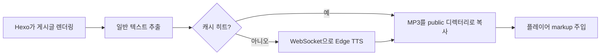

# hexo-tts-reader

> Hexo 게시글을 소리 내어 읽어 주는 플러그인입니다. **생성 시점**에 Microsoft Edge 온라인 TTS로
> 각 게시글의 MP3를 만들고, 결과를 캐시한 뒤 렌더링된 페이지에
> 플로팅 오디오 플레이어를 주입합니다.

[](https://www.npmjs.com/package/hexo-tts-reader)
[](https://nodejs.org/)
[](./LICENSE)

<!-- README-I18N:START -->

[English](./README.md) | [汉语](./README.zh.md) | [Español](./README.es.md) | [Français](./README.fr.md) | [Deutsch](./README.de.md) | [日本語](./README.ja.md) | **한국어** | [Português](./README.pt.md)

<!-- README-I18N:END -->

브라우저는 정적 `<audio>` 파일만 로드합니다. 런타임 TTS 서버, API 키,
클라이언트 측 JavaScript 합성이 필요 없습니다. 백엔드를 운영하거나
실행 시점에 음성 API 비용을 지불하지 않고도 낭독 기능을 원하는 블로그에 적합합니다.

## 목차

- [미리보기](#미리보기)
- [기능](#기능)
- [요구 사항](#요구-사항)
- [설치](#설치)
- [빠른 시작](#빠른-시작)
- [설정](#설정)
- [동작 방식](#동작-방식)
- [음성](#음성)
- [캐시](#캐시)
- [테마](#테마)
- [문제 해결](#문제-해결)
- [참고 및 제한 사항](#참고-및-제한-사항)
- [개발](#개발)
- [관련 링크](#관련-링크)
- [라이선스](#라이선스)

---

## 미리보기

브라우저에서 [`preview.html`](./preview.html)을 열면 Hexo 사이트나 TTS
네트워크 호출 없이 라이트/다크 모드의 플로팅 플레이어 UI를
체험할 수 있습니다.

---

## 기능

- **빌드 시점 합성** — 런타임 TTS 서비스 불필요, API 키 불필요
- **콘텐츠 해시 캐시** — 변경되지 않은 게시글은 빌드 간 재합성되지 않음
- **자동 주입** — 게시글 페이지에 자동 추가, 또는 `` 태그로 정확히 배치
- **플로팅 플레이어** — 재생 / 일시 정지 / 탐색 / 재생 속도(0.75× – 2×)
- **라이트 및 다크 테마**, 키보드 접근성 지원
- **스마트 텍스트 추출** — 코드 블록, 스크립트, 스타일, 임베디드 미디어 건너뜀
- **긴 글 안전** — 문장 경계에서 입력을 분할하고 MP3 프레임 연결
- **게시글별 옵트아웃** — front-matter로 비활성화

---

## 요구 사항

- Node.js **>= 18**
- Hexo **>= 5**
- 빌드 시 Microsoft Edge 온라인 TTS에 대한 네트워크 접근

---

## 설치

```bash
npm install hexo-tts-reader --save
```

또는 `yarn` / `pnpm` 사용:

```bash
yarn add hexo-tts-reader
pnpm add hexo-tts-reader
```

---

## 빠른 시작

1. 플러그인을 설치합니다.
2. 사이트의 `_config.yml`에 다음을 추가합니다:

   ```yaml
   reader:
     enable: true
   ```

3. `hexo clean && hexo generate`(또는 `hexo server`)를 실행합니다. 각 게시글 페이지
   오른쪽 하단에 플로팅 플레이어 버튼(기본 레이블: `朗读本文`)이 표시됩니다.
   로케일에 맞게 설정의 `buttonLabel`을 변경하세요.

끝입니다. 이후 빌드에서는 콘텐츠 해시 캐시 덕분에 변경된 게시글만
TTS 서비스를 호출합니다.

---

## 설정

기본값을 포함한 전체 설정:

```yaml
reader:
  enable: true
  autoInject: true
  voice: zh-CN-XiaoxiaoNeural
  rate: 0                                    # -100..100, relative percent
  pitch: 0                                   # -100..100, relative percent
  outputFormat: audio-24khz-48kbitrate-mono-mp3
  audioDir: audio                            # public audio output dir
  cacheDir: .hexo-reader-cache               # local cache dir (gitignore it)
  position: bottom-right                     # bottom-right | bottom-left | top-right | top-left
  buttonLabel: 朗读本文
  chunkSize: 4000                            # split long posts into <= N chars per request
  maxTextLength: 100000                      # hard upper bound per post
  failOnError: false                         # if true, build fails when TTS fails
  timeoutMs: 60000                           # per-chunk TTS timeout (ms)
  skip: []                                   # list of substrings to match against post.source
```

### 옵션 참조

| 옵션 | 유형 | 기본값 | 설명 |
| --- | --- | --- | --- |
| `enable` | boolean | `true` | 마스터 스위치. |
| `autoInject` | boolean | `true` | 모든 게시글에 플레이어를 자동으로 추가. ``만 사용할 경우 비활성화. |
| `voice` | string | `zh-CN-XiaoxiaoNeural` | Microsoft Edge 온라인 TTS의 임의 음성 ID. |
| `rate` | number | `0` | 상대적 말하기 속도, `-100..100`. 범위를 벗어난 값은 클램핑됨. |
| `pitch` | number | `0` | 상대적 피치, `-100..100`. 범위를 벗어난 값은 클램핑됨. |
| `outputFormat` | string | `audio-24khz-48kbitrate-mono-mp3` | `msedge-tts`가 지원하는 임의 형식. |
| `audioDir` | string | `audio` | 사이트 루트 아래 MP3 공개 출력 경로. 경로 탐색은 거부됨. |
| `cacheDir` | string | `.hexo-reader-cache` | 로컬 캐시 디렉터리(사이트 base 디렉터리 기준). 빌드 간 유지. |
| `position` | enum | `bottom-right` | `bottom-right`, `bottom-left`, `top-right`, `top-left` 중 하나. |
| `buttonLabel` | string | `朗读本文` | 토글 버튼의 aria-label / 툴팁. |
| `chunkSize` | number | `4000` | TTS 요청당 최대 문자 수, `200..8000`. |
| `maxTextLength` | number | `100000` | 게시글당 하드 상한, `100..1000000`. 더 긴 텍스트는 잘림. |
| `failOnError` | boolean | `false` | `true`이면 TTS 실패 시 `hexo generate` 전체가 중단됨. |
| `timeoutMs` | number | `60000` | 청크당 WebSocket 타임아웃, `5000..600000`. |
| `skip` | string[] | `[]` | `post.source`와 매칭되는 부분 문자열 목록. 선택한 게시글 건너뜀. |

### 게시글별 비활성화

게시글 front-matter에서:

```yaml
---
title: My private post
reader: false
---
```

### 수동 배치

`` 태그로 게시글 어디에나 플레이어를 삽입할 수 있습니다. 태그가 있으면
해당 게시글에서 자동 주입이 억제되어 플레이어는 하나만 표시됩니다:

```markdown
Some intro text.



The rest of the article.
```

### 경로로 건너뛰기

```yaml
reader:
  skip:
    - "draft/"
    - "_posts/private/"
```

`source`에 위 부분 문자열 중 하나를 포함하는 게시글은 건너뜁니다.

---

## 동작 방식



1. Hexo가 게시글을 렌더링한 후(`after_post_render` 필터), 플러그인은 HTML에서
   TTS에 적합한 일반 텍스트 표현을 추출합니다. 코드 블록, 스크립트, 스타일,
   임베디드 미디어는 제거됩니다.
2. `{ text, voice, rate, pitch, format }`의 SHA-1이 캐시 키가 됩니다.
3. `<cacheDir>/<key>.mp3`가 이미 있으면 재사용됩니다. 없으면 플러그인이
   [`msedge-tts`][msedge]를 통해 Microsoft Edge TTS에 WebSocket을 열고
   결과를 원자적으로 기록합니다(`*.tmp` → rename).
4. 긴 입력은 문장 경계(중국어 및 영어 구두점)에서 청크로 나뉘고,
   청크별로 합성된 뒤 원시 MP3 프레임으로 연결됩니다 — 재생에 안전합니다.
5. 생성기는 `<audioDir>/<key>.mp3` 아래에 MP3를, `assets/hexo-reader/` 아래에
   공유 `reader.js` / `reader.css`를 출력합니다.
6. 플레이어 markup과 `<link>` / `<script>` 스니펫이 게시글 콘텐츠에 추가되어
   정적 사이트와 함께 배포됩니다.

[msedge]: https://www.npmjs.com/package/msedge-tts

---

## 음성

Microsoft Edge 온라인 TTS가 지원하는 모든 음성을 사용할 수 있습니다. 예:

| Voice id | Locale | 설명 |
| --- | --- | --- |
| `zh-CN-XiaoxiaoNeural` | zh-CN | 기본값, 여성 |
| `zh-CN-YunxiNeural` | zh-CN | 남성 |
| `zh-CN-YunyangNeural` | zh-CN | 남성, 뉴스 스타일 |
| `en-US-AriaNeural` | en-US | 여성 |
| `en-US-GuyNeural` | en-US | 남성 |
| `ja-JP-NanamiNeural` | ja-JP | 여성 |
| `ko-KR-SunHiNeural` | ko-KR | 여성 |

전체 목록은 업스트림 음성 카탈로그를 참조하거나 `msedge-tts`로 `voices` 쿼리를
실행하세요.

---

## 캐시

- 캐시는 `<site>/<cacheDir>`에 있으며 빌드 간 유지됩니다.
- 키는 파일 이름이 아닌 **콘텐츠**를 기준으로 하므로, 이름 변경은 재합성을
  유발하지 않고 작은 편집은 영향받은 게시글만 재생성합니다.
- 전체 재합성을 강제하려면 캐시 디렉터리를 삭제하세요.
- 권장 `.gitignore` 항목:

  ```gitignore
  .hexo-reader-cache/
  ```

---

## 테마

주입된 플레이어는 `hexo-reader__` 접두사가 붙은 CSS 클래스를 사용합니다.
색상을 사용자 지정하려면 테마 스타일시트에서 덮어쓰세요. 예:

```css
.hexo-reader__toggle {
  background: #1f6feb;
  color: #fff;
}
.hexo-reader__panel {
  border-radius: 12px;
}
```

플레이어는 `prefers-color-scheme: dark`를 기본으로 따릅니다.

---

## 문제 해결

**`hexo generate`에서 빌드가 멈추거나 타임아웃됩니다.**
빌드에 Edge TTS 네트워크 접근이 필요합니다. 방화벽 뒤이거나 오프라인에서
실행 중이면 `failOnError: false`(기본값)로 실패를 우아하게 처리하거나
`skip`으로 해당 게시글을 건너뛰세요.

**빌드 후 게시글에 플레이어가 없습니다.**
Hexo 로그에서 `hexo-reader: TTS failed for "<title>"`를 확인하세요. TTS가 실패하고
`failOnError`가 `false`이면 해당 게시글의 플레이어는 조용히 건너뜁니다.

**게시글에 플레이어가 두 번 나타납니다.**
같은 게시글에서 `autoInject: true`와 `` 태그를 함께 사용하지 마세요.
태그가 있으면 플러그인이 이미 자동 주입을 억제합니다 — 태그가 렌더링되었는지(주석
처리되지 않았는지), 테마 템플릿이 자체 복사본을 추가하지 않는지 확인하세요.

**오디오가 재생되지 않음 / 404.**
배포에 `audio/` 및 `assets/hexo-reader/` 디렉터리가 포함되어 있는지 확인하세요.
기본값이 아닌 `audioDir`을 설정한 경우 CDN 규칙에 의해 차단되지 않는지 확인하세요.

**TTS를 전혀 호출하지 않고 사이트를 배포하고 싶습니다.**
이전에 생성한 MP3로 `<cacheDir>`를 미리 채우세요. 플러그인은 콘텐츠 해시로
네트워크 없이 재사용합니다.

---

## 참고 및 제한 사항

- 합성은 빌드 시점에 이루어지며 Edge TTS 네트워크 접근이 필요합니다.
- `msedge-tts` >= 2.0.5가 필요합니다(본 플러그인에 포함). Microsoft는 2025년 말
  Edge Read Aloud API를 변경했습니다. 이전 클라이언트는 오디오 대신 HTML 오류
  페이지를 받습니다.
- 각 게시글은 MP3 하나가 됩니다. 매우 긴 게시글은 청크로 나뉘어 연결됩니다.
- 게시글 TTS가 실패하고 `failOnError`가 `false`(기본값)이면 해당 게시글에는
  플레이어가 주입되지 않고 빌드는 계속됩니다.
- 캐시 키는 일반 텍스트 + 합성 매개변수의 SHA-1입니다. 보안이 아닌 콘텐츠
  식별자로만 사용됩니다.

---

## 개발

```bash
git clone https://github.com/xichenx/hexo-tts-reader.git
cd hexo-tts-reader
npm install
npm test
```

테스트는 Node 내장 테스트 러너(`node --test`)를 사용합니다.

---

## 관련 링크

- [npm package](https://www.npmjs.com/package/hexo-tts-reader)
- [GitHub repository](https://github.com/xichenx/hexo-tts-reader)
- [Report an issue](https://github.com/xichenx/hexo-tts-reader/issues)
- [msedge-tts](https://www.npmjs.com/package/msedge-tts) — 기반 TTS 클라이언트

---

## 라이선스

[MIT](./LICENSE) © 刘明智(xichen)
