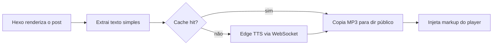

# hexo-tts-reader

> Um plugin Hexo que lê seus posts em voz alta. Ele gera um MP3 para cada post na
> **geração** usando o TTS online do Microsoft Edge, armazena o resultado em cache e
> injeta um player de áudio flutuante na página renderizada.

[](https://www.npmjs.com/package/hexo-tts-reader)
[](https://nodejs.org/)
[](./LICENSE)

<!-- README-I18N:START -->

[English](./README.md) | [汉语](./README.zh.md) | [Español](./README.es.md) | [Français](./README.fr.md) | [Deutsch](./README.de.md) | [日本語](./README.ja.md) | [한국어](./README.ko.md) | **Português**

<!-- README-I18N:END -->

O navegador carrega apenas um arquivo `<audio>` estático — sem servidor TTS em tempo
de execução, sem chave de API, sem síntese JavaScript no cliente. Ideal para blogs
que querem leitura em voz alta sem operar um backend ou pagar por uma API de voz
em tempo de execução.

## Índice

- [Pré-visualização](#pré-visualização)
- [Recursos](#recursos)
- [Requisitos](#requisitos)
- [Instalação](#instalação)
- [Início rápido](#início-rápido)
- [Configuração](#configuração)
- [Como funciona](#como-funciona)
- [Vozes](#vozes)
- [Cache](#cache)
- [Temas](#temas)
- [Solução de problemas](#solução-de-problemas)
- [Notas e limitações](#notas-e-limitações)
- [Desenvolvimento](#desenvolvimento)
- [Links relacionados](#links-relacionados)
- [Licença](#licença)

---

## Pré-visualização

Abra [`preview.html`](./preview.html) no navegador para experimentar a interface do
player flutuante em modo claro e escuro — sem site Hexo ou chamada de rede TTS.

---

## Recursos

- **Síntese em tempo de build** — sem serviço TTS em runtime, sem chave de API
- **Cache por hash de conteúdo** — posts inalterados não são ressintetizados entre builds
- **Injeção automática** em páginas de post, ou tag `` manual para posicionamento preciso
- **Player flutuante** com play / pause / seek / velocidade de reprodução (0.75× – 2×)
- **Temas claro e escuro**, acessível por teclado
- **Extração inteligente de texto** — ignora blocos de código, scripts, estilos e mídia embutida
- **Seguro para posts longos** — divide a entrada nos limites de frase e concatena frames MP3
- **Desativação por post** via front-matter

---

## Requisitos

- Node.js **>= 18**
- Hexo **>= 5**
- Acesso de rede ao TTS online do Microsoft Edge no momento do build

---

## Instalação

```bash
npm install hexo-tts-reader --save
```

ou com `yarn` / `pnpm`:

```bash
yarn add hexo-tts-reader
pnpm add hexo-tts-reader
```

---

## Início rápido

1. Instale o plugin.
2. Adicione o seguinte ao `_config.yml` do seu site:

   ```yaml
   reader:
     enable: true
   ```

3. Execute `hexo clean && hexo generate` (ou `hexo server`). Cada página de post
   ganhará um botão de player flutuante (rótulo padrão: `朗读本文`) no canto
   inferior direito. Altere `buttonLabel` na config para o seu locale.

Pronto. Em builds subsequentes, o cache por hash de conteúdo significa que apenas
posts alterados acionam o serviço TTS.

---

## Configuração

Configuração completa com padrões:

```yaml
reader:
  enable: true
  autoInject: true
  voice: zh-CN-XiaoxiaoNeural
  rate: 0                                    # -100..100, relative percent
  pitch: 0                                   # -100..100, relative percent
  outputFormat: audio-24khz-48kbitrate-mono-mp3
  audioDir: audio                            # public audio output dir
  cacheDir: .hexo-reader-cache               # local cache dir (gitignore it)
  position: bottom-right                     # bottom-right | bottom-left | top-right | top-left
  buttonLabel: 朗读本文
  chunkSize: 4000                            # split long posts into <= N chars per request
  maxTextLength: 100000                      # hard upper bound per post
  failOnError: false                         # if true, build fails when TTS fails
  timeoutMs: 60000                           # per-chunk TTS timeout (ms)
  skip: []                                   # list of substrings to match against post.source
```

### Referência de opções

| Opção | Tipo | Padrão | Notas |
| --- | --- | --- | --- |
| `enable` | boolean | `true` | Interruptor principal. |
| `autoInject` | boolean | `true` | Anexa o player a cada post automaticamente. Desative se quiser usar apenas ``. |
| `voice` | string | `zh-CN-XiaoxiaoNeural` | Qualquer ID de voz do TTS online do Microsoft Edge. |
| `rate` | number | `0` | Taxa de fala relativa, `-100..100`. Valores fora do intervalo são limitados. |
| `pitch` | number | `0` | Tom relativo, `-100..100`. Valores fora do intervalo são limitados. |
| `outputFormat` | string | `audio-24khz-48kbitrate-mono-mp3` | Qualquer formato suportado por `msedge-tts`. |
| `audioDir` | string | `audio` | Caminho público sob a raiz do site onde os MP3s são emitidos. Path traversal é rejeitado. |
| `cacheDir` | string | `.hexo-reader-cache` | Diretório de cache local (resolvido a partir do base dir do site). Persiste entre builds. |
| `position` | enum | `bottom-right` | Um de `bottom-right`, `bottom-left`, `top-right`, `top-left`. |
| `buttonLabel` | string | `朗读本文` | Aria-label / tooltip do botão de alternância. |
| `chunkSize` | number | `4000` | Máximo de caracteres por requisição TTS, `200..8000`. |
| `maxTextLength` | number | `100000` | Limite rígido por post, `100..1000000`. Texto mais longo é truncado. |
| `failOnError` | boolean | `false` | Quando `true`, uma falha TTS aborta todo o `hexo generate`. |
| `timeoutMs` | number | `60000` | Timeout WebSocket por chunk, `5000..600000`. |
| `skip` | string[] | `[]` | Substrings correspondidas contra `post.source` para pular posts selecionados. |

### Desativar por post

No front-matter de um post:

```yaml
---
title: My private post
reader: false
---
```

### Posicionamento manual

Insira o player em qualquer lugar de um post com a tag ``. Quando a tag
está presente, a injeção automática é suprimida para esse post, então você obtém
apenas um player:

```markdown
Some intro text.



The rest of the article.
```

### Ignorar por caminho

```yaml
reader:
  skip:
    - "draft/"
    - "_posts/private/"
```

Qualquer post cujo `source` contenha uma das substrings acima é ignorado.

---

## Como funciona



1. Depois que o Hexo renderiza um post (filtro `after_post_render`), o plugin extrai
   uma representação em texto simples adequada para TTS do HTML. Blocos de código,
   scripts, estilos e mídia embutida são removidos.
2. Um SHA-1 de `{ text, voice, rate, pitch, format }` torna-se a chave de cache.
3. Se `<cacheDir>/<key>.mp3` já existir, é reutilizado. Caso contrário, o plugin
   abre um WebSocket para o Microsoft Edge TTS (via [`msedge-tts`][msedge]) e grava
   o resultado atomicamente (`*.tmp` → rename).
4. Entradas longas são divididas em chunks nos limites de frase (pontuação chinesa
   e inglesa), sintetizadas chunk a chunk e concatenadas como frames MP3 brutos —
   o que é seguro para reprodução.
5. O gerador emite o MP3 em `<audioDir>/<key>.mp3`, mais um `reader.js` / `reader.css`
   compartilhado em `assets/hexo-reader/`.
6. O markup do player e um snippet `<link>` / `<script>` são anexados ao conteúdo
   do post para serem entregues com o site estático.

[msedge]: https://www.npmjs.com/package/msedge-tts

---

## Vozes

Qualquer voz suportada pelo TTS online do Microsoft Edge funciona. Alguns exemplos:

| Voice id | Locale | Notas |
| --- | --- | --- |
| `zh-CN-XiaoxiaoNeural` | zh-CN | Padrão, feminina |
| `zh-CN-YunxiNeural` | zh-CN | Masculina |
| `zh-CN-YunyangNeural` | zh-CN | Masculina, estilo noticiário |
| `en-US-AriaNeural` | en-US | Feminina |
| `en-US-GuyNeural` | en-US | Masculina |
| `ja-JP-NanamiNeural` | ja-JP | Feminina |
| `ko-KR-SunHiNeural` | ko-KR | Feminina |

Para a lista completa, consulte o catálogo de vozes upstream ou execute uma
consulta `voices` via `msedge-tts`.

---

## Cache

- O cache fica em `<site>/<cacheDir>` e persiste entre builds.
- É indexado pelo **conteúdo**, não pelo nome do arquivo, então renomeações não
  disparam ressíntese e edições menores regeneram apenas os posts afetados.
- Para forçar ressíntese completa, exclua o diretório de cache.
- Entrada recomendada no `.gitignore`:

  ```gitignore
  .hexo-reader-cache/
  ```

---

## Temas

O player injetado usa classes CSS prefixadas com `hexo-reader__`. Para
personalizar cores, sobrescreva-as na folha de estilo do seu tema, por exemplo:

```css
.hexo-reader__toggle {
  background: #1f6feb;
  color: #fff;
}
.hexo-reader__panel {
  border-radius: 12px;
}
```

O player respeita `prefers-color-scheme: dark` por padrão.

---

## Solução de problemas

**O build trava ou expira em `hexo generate`.**
Seu build precisa de acesso de rede ao Edge TTS. Se estiver atrás de firewall ou
executando offline, defina `failOnError: false` (padrão) para que falhas degradem
graciosamente, ou ignore os posts afetados via `skip`.

**Um post não tem player após o build.**
Verifique o log do Hexo por `hexo-reader: TTS failed for "<title>"`. Se o TTS falhou
e `failOnError` é `false`, o player é silenciosamente ignorado para esse post.

**O player aparece duas vezes em um post.**
Não combine `autoInject: true` com a tag `` no mesmo post. O plugin
já suprime a injeção automática quando a tag está presente — certifique-se de que
a tag está renderizada (não comentada) e que nenhum template do tema adiciona
sua própria cópia.

**O áudio não reproduz / 404.**
Certifique-se de que sua implantação inclui os diretórios `audio/` e
`assets/hexo-reader/`. Se definiu um `audioDir` não padrão, verifique se não
está bloqueado pelas regras da CDN.

**Quero publicar o site sem nunca chamar TTS.**
Pré-popule `<cacheDir>` com MP3s gerados anteriormente. O plugin os reutiliza
por hash de conteúdo sem acessar a rede.

---

## Notas e limitações

- A síntese ocorre no momento do build e precisa de acesso de rede ao Edge TTS.
- Requer `msedge-tts` >= 2.0.5 (incluído neste plugin). A Microsoft alterou a API
  Edge Read Aloud no final de 2025; clientes mais antigos recebem uma página HTML
  de erro em vez de áudio.
- Cada post vira um MP3; posts muito longos são divididos em chunks e concatenados.
- Se o TTS falhar para um post e `failOnError` for `false` (padrão), o player
  simplesmente não é injetado para esse post e o build continua.
- A chave de cache é um SHA-1 de texto simples + parâmetros de síntese. É usada
  apenas como identificador de conteúdo, não para segurança.

---

## Desenvolvimento

```bash
git clone https://github.com/xichenx/hexo-tts-reader.git
cd hexo-tts-reader
npm install
npm test
```

Os testes usam o test runner integrado do Node (`node --test`).

---

## Links relacionados

- [npm package](https://www.npmjs.com/package/hexo-tts-reader)
- [GitHub repository](https://github.com/xichenx/hexo-tts-reader)
- [Report an issue](https://github.com/xichenx/hexo-tts-reader/issues)
- [msedge-tts](https://www.npmjs.com/package/msedge-tts) — cliente TTS subjacente

---

## Licença

[MIT](./LICENSE) © 刘明智(xichen)
