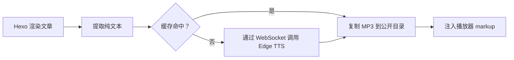

# hexo-tts-reader

> 一款 Hexo 插件，可将文章朗读出来。它在**生成阶段**使用 Microsoft Edge 在线 TTS
> 为每篇文章合成 MP3，缓存结果，并在渲染后的页面中注入一个悬浮音频播放器。

[](https://www.npmjs.com/package/hexo-tts-reader)
[](https://nodejs.org/)
[](./LICENSE)

<!-- README-I18N:START -->

[English](./README.md) | **汉语** | [Español](./README.es.md) | [Français](./README.fr.md) | [Deutsch](./README.de.md) | [日本語](./README.ja.md) | [한국어](./README.ko.md) | [Português](./README.pt.md)

<!-- README-I18N:END -->

浏览器只会加载静态的 `<audio>` 文件——无需运行时 TTS 服务、无需 API 密钥、
也无需客户端 JavaScript 合成。适合希望提供朗读功能、又不想运维后端或在运行时
为语音 API 付费的博客。

## 目录

- [预览](#预览)
- [功能特性](#功能特性)
- [环境要求](#环境要求)
- [安装](#安装)
- [快速开始](#快速开始)
- [配置](#配置)
- [工作原理](#工作原理)
- [语音](#语音)
- [缓存](#缓存)
- [主题定制](#主题定制)
- [故障排查](#故障排查)
- [说明与限制](#说明与限制)
- [开发](#开发)
- [相关链接](#相关链接)
- [许可证](#许可证)

---

## 预览

在浏览器中打开 [`preview.html`](./preview.html)，即可在浅色与深色模式下试用悬浮播放器
UI——无需 Hexo 站点或 TTS 网络请求。

---

## 功能特性

- **构建时合成** — 无需运行时 TTS 服务，无需 API 密钥
- **内容哈希缓存** — 未变更的文章在多次构建之间不会重新合成
- **自动注入**到文章页面，或使用 `` 标签手动精确放置
- **悬浮播放器**，支持播放 / 暂停 / 跳转 / 播放速度（0.75× – 2×）
- **浅色与深色主题**，支持键盘操作
- **智能文本提取** — 跳过代码块、脚本、样式和嵌入式媒体
- **长文安全** — 在句子边界分块输入并拼接 MP3 帧
- **单篇禁用** — 通过 front-matter 按文章关闭

---

## 环境要求

- Node.js **>= 18**
- Hexo **>= 5**
- 构建时需能访问 Microsoft Edge 在线 TTS

---

## 安装

```bash
npm install hexo-tts-reader --save
```

或使用 `yarn` / `pnpm`：

```bash
yarn add hexo-tts-reader
pnpm add hexo-tts-reader
```

---

## 快速开始

1. 安装插件。
2. 在站点的 `_config.yml` 中添加：

   ```yaml
   reader:
     enable: true
   ```

3. 运行 `hexo clean && hexo generate`（或 `hexo server`）。每篇文章页面右下角
   会出现悬浮播放器按钮（默认标签：`朗读本文`）。可在配置中修改 `buttonLabel`
   以适配你的语言环境。

就这么简单。后续构建中，内容哈希缓存意味着只有变更过的文章会调用 TTS 服务。

---

## 配置

完整配置及默认值：

```yaml
reader:
  enable: true
  autoInject: true
  voice: zh-CN-XiaoxiaoNeural
  rate: 0                                    # -100..100, relative percent
  pitch: 0                                   # -100..100, relative percent
  outputFormat: audio-24khz-48kbitrate-mono-mp3
  audioDir: audio                            # public audio output dir
  cacheDir: .hexo-reader-cache               # local cache dir (gitignore it)
  position: bottom-right                     # bottom-right | bottom-left | top-right | top-left
  buttonLabel: 朗读本文
  chunkSize: 4000                            # split long posts into <= N chars per request
  maxTextLength: 100000                      # hard upper bound per post
  failOnError: false                         # if true, build fails when TTS fails
  timeoutMs: 60000                           # per-chunk TTS timeout (ms)
  skip: []                                   # list of substrings to match against post.source
```

### 选项说明

| 选项 | 类型 | 默认值 | 说明 |
| --- | --- | --- | --- |
| `enable` | boolean | `true` | 总开关。 |
| `autoInject` | boolean | `true` | 自动在每篇文章末尾追加播放器。若仅使用 ``，请关闭此项。 |
| `voice` | string | `zh-CN-XiaoxiaoNeural` | 任意 Microsoft Edge 在线 TTS 语音 ID。 |
| `rate` | number | `0` | 相对语速，`-100..100`。超出范围的值会被截断。 |
| `pitch` | number | `0` | 相对音调，`-100..100`。超出范围的值会被截断。 |
| `outputFormat` | string | `audio-24khz-48kbitrate-mono-mp3` | `msedge-tts` 支持的任意格式。 |
| `audioDir` | string | `audio` | 站点根目录下的公开 MP3 输出路径。拒绝路径穿越。 |
| `cacheDir` | string | `.hexo-reader-cache` | 本地缓存目录（从站点 base 目录解析）。跨构建持久保存。 |
| `position` | enum | `bottom-right` | 可选 `bottom-right`、`bottom-left`、`top-right`、`top-left`。 |
| `buttonLabel` | string | `朗读本文` | 切换按钮的 aria-label / 工具提示。 |
| `chunkSize` | number | `4000` | 每次 TTS 请求的最大字符数，`200..8000`。 |
| `maxTextLength` | number | `100000` | 单篇文章硬上限，`100..1000000`。更长文本会被截断。 |
| `failOnError` | boolean | `false` | 为 `true` 时，TTS 失败会中止整个 `hexo generate`。 |
| `timeoutMs` | number | `60000` | 每个分块的 WebSocket 超时，`5000..600000`。 |
| `skip` | string[] | `[]` | 与 `post.source` 匹配的子串列表，用于跳过指定文章。 |

### 按文章禁用

在文章 front-matter 中：

```yaml
---
title: My private post
reader: false
---
```

### 手动放置

使用 `` 标签在文章中任意位置插入播放器。当标签存在时，
该文章会抑制自动注入，因此只会出现一个播放器：

```markdown
Some intro text.



The rest of the article.
```

### 按路径跳过

```yaml
reader:
  skip:
    - "draft/"
    - "_posts/private/"
```

`source` 包含上述任一子串的文章将被跳过。

---

## 工作原理



1. Hexo 渲染文章后（`after_post_render` 过滤器），插件从 HTML 中提取适合 TTS
   的纯文本。代码块、脚本、样式和嵌入式媒体会被移除。
2. 对 `{ text, voice, rate, pitch, format }` 计算 SHA-1 作为缓存键。
3. 若 `<cacheDir>/<key>.mp3` 已存在则复用；否则插件通过 [`msedge-tts`][msedge]
   连接 Microsoft Edge TTS WebSocket，并以原子方式写入结果（`*.tmp` → rename）。
4. 长文本在句子边界（中英文标点）分块，逐块合成，并作为原始 MP3 帧拼接——
   播放是安全的。
5. 生成器在 `<audioDir>/<key>.mp3` 下输出 MP3，并在 `assets/hexo-reader/` 下
   输出共享的 `reader.js` / `reader.css`。
6. 播放器 markup 以及 `<link>` / `<script>` 片段会追加到文章内容中，随静态站点一起发布。

[msedge]: https://www.npmjs.com/package/msedge-tts

---

## 语音

支持 Microsoft Edge 在线 TTS 的任意语音。示例：

| Voice id | Locale | 说明 |
| --- | --- | --- |
| `zh-CN-XiaoxiaoNeural` | zh-CN | 默认，女声 |
| `zh-CN-YunxiNeural` | zh-CN | 男声 |
| `zh-CN-YunyangNeural` | zh-CN | 男声，新闻风格 |
| `en-US-AriaNeural` | en-US | 女声 |
| `en-US-GuyNeural` | en-US | 男声 |
| `ja-JP-NanamiNeural` | ja-JP | 女声 |
| `ko-KR-SunHiNeural` | ko-KR | 女声 |

完整列表请参阅上游语音目录，或通过 `msedge-tts` 运行 `voices` 查询。

---

## 缓存

- 缓存位于 `<site>/<cacheDir>`，跨构建持久保存。
- 键基于**内容**而非文件名，因此重命名不会触发重新合成，小幅编辑只会重新生成受影响的文章。
- 若要强制全部重新合成，删除缓存目录即可。
- 建议的 `.gitignore` 条目：

  ```gitignore
  .hexo-reader-cache/
  ```

---

## 主题定制

注入的播放器使用以 `hexo-reader__` 为前缀的 CSS 类。若要自定义颜色，
可在主题样式表中覆盖，例如：

```css
.hexo-reader__toggle {
  background: #1f6feb;
  color: #fff;
}
.hexo-reader__panel {
  border-radius: 12px;
}
```

播放器默认支持 `prefers-color-scheme: dark`。

---

## 故障排查

**`hexo generate` 构建卡住或超时。**
构建需要能访问 Edge TTS 网络。若处于防火墙后或离线运行，可设置
`failOnError: false`（默认）使失败优雅降级，或通过 `skip` 跳过受影响的文章。

**构建后某篇文章没有播放器。**
查看 Hexo 日志中的 `hexo-reader: TTS failed for "<title>"`。若 TTS 失败且
`failOnError` 为 `false`，该文章的播放器会被静默跳过。

**文章中播放器出现两次。**
不要在同一篇文章中同时使用 `autoInject: true` 与 `` 标签。
插件在标签存在时已会抑制自动注入——请确保标签已渲染（未被注释），且主题模板
未额外添加副本。

**音频无法播放 / 404。**
确保部署包含 `audio/` 与 `assets/hexo-reader/` 目录。若使用非默认 `audioDir`，
请确认 CDN 规则未拦截。

**希望发布站点时从不调用 TTS。**
预先用已生成的 MP3 填充 `<cacheDir>`。插件会按内容哈希复用，无需联网。

---

## 说明与限制

- 合成在构建时进行，需要访问 Edge TTS 网络。
- 需要 `msedge-tts` >= 2.0.5（随本插件捆绑）。Microsoft 在 2025 年底更改了
  Edge Read Aloud API；旧客户端会收到 HTML 错误页而非音频。
- 每篇文章对应一个 MP3；超长文章会分块并拼接。
- 若某篇文章 TTS 失败且 `failOnError` 为 `false`（默认），该文章不会注入播放器，构建继续。
- 缓存键为纯文本 + 合成参数的 SHA-1，仅作内容标识，不用于安全目的。

---

## 开发

```bash
git clone https://github.com/xichenx/hexo-tts-reader.git
cd hexo-tts-reader
npm install
npm test
```

测试使用 Node 内置测试运行器（`node --test`）。

---

## 相关链接

- [npm 包](https://www.npmjs.com/package/hexo-tts-reader)
- [GitHub 仓库](https://github.com/xichenx/hexo-tts-reader)
- [提交 Issue](https://github.com/xichenx/hexo-tts-reader/issues)
- [msedge-tts](https://www.npmjs.com/package/msedge-tts) — 底层 TTS 客户端

---

## 许可证

[MIT](./LICENSE) © 刘明智(xichen)
